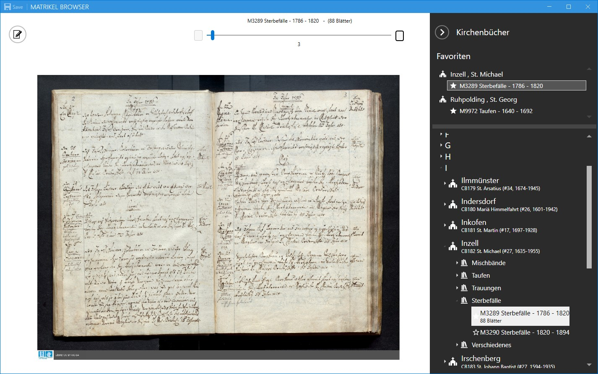
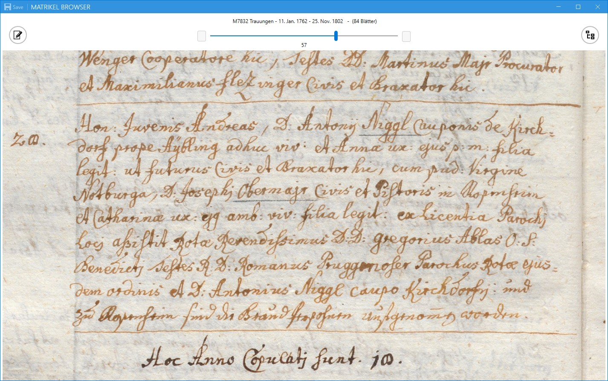
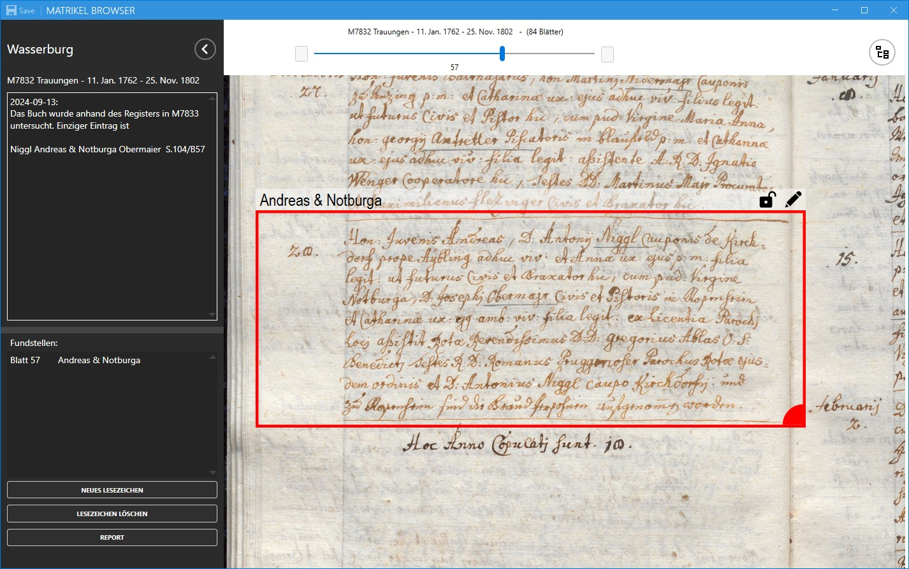
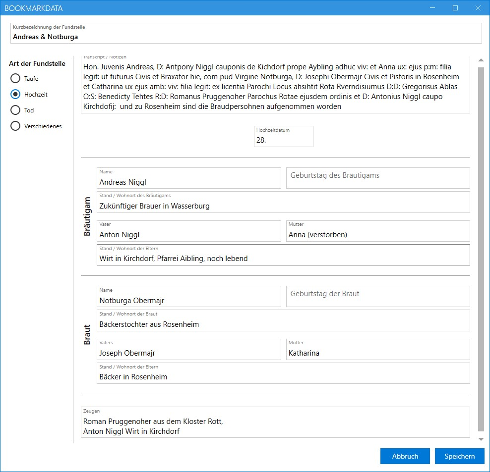

# MatrikelBrowser

## Motivation
Die Digitalisate der Kirchenbücher, die von den verschiedenen kirchlichen Archiven für genalogische Forschung bereitgestellt werden, erleichtern die Arbeit deutlich im Vergleich zu den früher notwendigen Besuchen vor Ort. Allerdings bieten die aktuell genutzten Browser noch nicht alle Möglichkeiten, die man sich für eine effiziente digitale Arbeitsweise wünschen würde. Besonders hilfreich wären Funktionen wie das Setzen von Lesezeichen, um bestimmte Stellen schnell wiederzufinden, oder die Möglichkeit, gefundene Daten direkt und ohne Systemwechsel zu erfassen. Auch der Wechsel zwischen mehreren Büchern, etwa vom Register zum eigentlichen Kirchenbuch, gestaltet sich derzeit noch mühsam.

Der MatrikelBrowser wurde entwickelt, um genau dieses Problem bei den Kirchenbüchern des digitalen Archivs des Erzbistums München und Freising (AEM) zu lösen.

## Bedienung der Software
### Navigation

Die Bedienung ist bewusst einfach gehalten. Am rechten Bildschirmrand findet sich eine übersichtlich strukturierte Liste aller im AEM zugänglichen Kirchenbücher (momentan ca. 10270 in 622 Pfarreien).

Wählt man eines der Bücher aus, wird es im Hauptbereich des Bildschirms dargestellt. Für die Navigation zwischen den Seiten stehen ein Schieberegler in der oberen Mitte sowie zwei Tasten links und rechts davon zur Verfügung. Das Mausrad ermöglicht ein bequemes Hinein- und Herauszoomen in die Seite, während sich die Ansicht mit gedrückter linker Maustaste frei auf dem Bildschirm verschieben lässt.

Um die Buchseite möglichst groß anzuzeigen, kann das Flyout mit der Liste der Bücher eingeklappt werden. Jede betrachtete Seite wird nach dem Herunterladen lokal gespeichert. Dadurch können spätere Zugriffe wesentlich schneller erfolgen, und die Server des Archivs werden entlastet.

### Notizen und Fundstellen

Mit der kreisförmigen Schaltfläche links oben (Edit-Icon) kann das Notiz-Flyout ein- und ausgeklappt werden. Dieses bietet zwei Bereiche: Im oberen Abschnitt lassen sich allgemeine Notizen zum Kirchenbuch erfassen, während der untere Bereich der Verwaltung von Lesezeichen bzw. Fundstellen dient.

Um ein Lesezeichen zu setzen, navigiert man zunächst zur gewünschten Seite. Über das Kontextmenü (rechte Maustaste) kann an einer beliebigen Stelle auf der Seite eine Fundstelle definiert werden. Diese lässt sich per Maus frei verschieben, und ihre Größe kann durch Ziehen am Viertelkreis in der rechten unteren Ecke angepasst werden. Idealerweise wird das Lesezeichen so positioniert und skaliert, dass der relevante Eintrag vollständig innerhalb des Rechtecks liegt. Mit dem Schloss-Symbol in der oberen rechten Ecke des Lesezeichens können Position und Größe gesperrt werden, um versehentliche Änderungen zu vermeiden.

Definierte Fundstellen erscheinen automatisch in der Liste im unteren Bereich des Notiz-Flyouts. Ein Klick auf eine Fundstelle in der Liste öffnet direkt die entsprechende Seite, auf der sich das Lesezeichen befindet.

Mit dem Stiftsymbol oben rechts am Lesezeichen lässt sich eine Eingabemaske öffnen, in der Transkripte, Notizen sowie verschiedene Details zur Fundstelle eingetragen werden können. Abhängig von der Art der Fundstelle kann man zwischen spezifischen Kategorien wie Taufen, Hochzeiten oder Begräbnissen wählen, um die Informationen entsprechend zu strukturieren.

Diese Funktion erleichtert es, relevante Daten direkt an der Fundstelle zu erfassen und zu organisieren, wodurch die Nachverfolgung und spätere Auswertung deutlich effizienter wird.

### Erstellen eines Reports

Mit der untersten Schaltfläche im Notiz-Flyout lässt sich ein PDF-Report erstellen, der alle Fundstellen des aktuellen Kirchenbuchs übersichtlich dokumentiert. Der Report enthält für jede Fundstelle den entsprechenden Ausschnitt aus dem Kirchenbuch sowie die eingetragenen Detaildaten.

Zusätzlich werden folgende Verknüpfungen für jede Fundstelle generiert:
- Ein Link zum AEM-Browser mit der geöffneten Seite der Fundstelle.
- Ein Permalink zum im AEM gespeicherten Bild der Seite.
- Ein Link zur lokal gespeicherten Kopie der Seite.

Die ersten beiden Verknüpfungen eignen sich hervorragend als Teil einer Quellenangabe oder eines Zitats. Sie können über das Kontextmenü einfach in die Zwischenablage kopiert und beispielsweise in einer Genealogie-Software eingefügt werden.

[Hier](media/cb489-wasserburg-st._jakob_m7832-trauungen_-_11._jan._1762_-_25._nov._1802.pdf) finden sie den mit den obigen Daten erzeugten Report